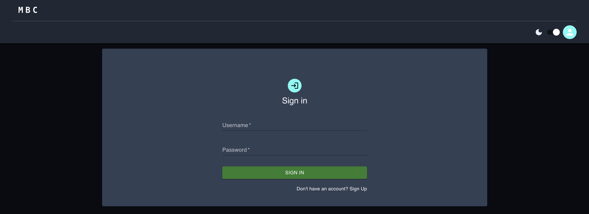

# MyBodyCompose (MBC)

# Description

MyBodyCompose (MBC) is a comprehensive fitness tracking application designed to assist users in managing their body measurements, calories intake, and workout routines. The app aims to provide a centralized platform for users to monitor their fitness progress, visualize trends, and stay motivated on their fitness journey.

## Key Features

1. Body Measurements Tracking: Users can input and track various body measurements such as weight, height, body fat percentage, BMI, water percentage, basal metabolism, visceral fat, bone mass, muscle mass, protenin percentage, ideal weight and body type. MBC stores this data and allows users to view their progress over time through interactive charts and graphs.
2. Calories Intake Monitoring: MBC includes a calorie tracker where users can log their daily food intake and monitor their calorie consumption. The app provides nutritional insights and tracks macronutrients.
3. Workout Logging: Users can log their workouts, including exercises performed, duration, intensity, and calories burned.
4. Dashboard and Trends Analysis: The app features a comprehensive dashboard that displays daily measurements, calorie intake, workout summaries, and progress indicators. Users can visualize trends over time, set goals, and track their achievements.
5. Automatic body measurements logging. MBC enables users to transmit their daily measurements from Xiaomi Composition Scale via Bluetooth.

MyBodyCompose targets individuals seeking to improve their health and wellness. It caters to users who prefer a data-driven approach to fitness tracking and general weight loss.

## Screenshots

<figure>
      
      <figcaption>Login Page (Light Mode)</figcaption>
</figure>

<figure>
      
      <figcaption>Login Page (Dark Mode)</figcaption>
</figure>

<figure>
      
      <figcaption>Daily Goals</figcaption>
</figure>

<figure>
      
      <figcaption>Body Journey</figcaption>
</figure>

<figure>
      
      <figcaption>Body Composition Trends</figcaption>
</figure>

## Tech Stack

|          | Stack        | Desc.                                                                            |
| -------- | ------------ | -------------------------------------------------------------------------------- |
| DB       | PostgreSQL   | For data storage and management.                                                 |
| Backend  | Python-Flask | SQL statements and API development are handled by flask-sqlalchemy's ORM toolkit |
| Frontend | React        | For user interface development, interactive charts/graphs for data visualisation |

# Getting Started

## Pre-requisites

-   Node.js
-   PostgresQL
-   Python version >= v3.9

## Installation

1. Clone the repository

```bash
git clone https://github.com/andreteo/my-body-compose.git
```

2. Navigate into the project directory

```bash
cd my-body-compose
```

3. Install the frontend dependencies
    - `cd frontend`
    - `npm i`
    - create a .env file and include the following: `VITE_BACKEND_SERVER=http://127.0.0.1:<PORT>`
    - Start frontend: `npm start`.
4. Install and Connect to PostgreSQL database
    - From your terminal, open a PSQL shell: `psql postgres`.
    - List all databases: `\l`.
    - Create database: `create database mybodycomposition;`.
    - create a new user: `create user <Your Username> with encrypted password '<Your Password>';`
    - Connect to databsae : `\c mybodycomposition;`
    - Grant all permissions to your username: `GRANT USAGE, SELECT ON ALL SEQUENCES IN SCHEMA public TO <Username>;` and `grant all on all tables in schema public to <Username>;`
    - Create the tables from './docs/psql_tables.sql' using either PGAdmin or PSQL Shell.
5. Install backend dependencies. Run the following commands in terminal
    ```bash
    cd backend
    python -m venv .venv
    . .venv/bin/activate
    pip install -U pip wheel setuptools
    pip install -r requirements.txt
    ```
6. Similar to frontend, create a .env file and paste your PostGreSQL database environment variables in.
   | Env Variable| Value |
   |---|---|
   |POSTGRES_USER| Username of usercreated in step 4. |
   |POSTGRES_PASS| Password of user created in step 4. |
   |POSTGRES_PORT| 5432|
   |POSTGRES_HOST| 127.0.0.1 |
   |POSTGRES_DB| "mybodycomposition" |
   |JWT_SECRET_KEY| `follow step 7. `|

7. To create your JWT_SECRET_KEY, visit [random.org string generator](https://www.random.org/strings/), and generate a random string. Ensure that the checkboxes Numeric digits, Uppercase and Lowercase letters are ticked. Once generated, copy and paste the value in the backend .env file.
8. Start backend server `python server.py`.

# APIs

| Endpoint                    | Method | Description                                                                 | Authentication                    | Request Body                                                     | Response                                                                                                                                                                              |
| --------------------------- | ------ | --------------------------------------------------------------------------- | --------------------------------- | ---------------------------------------------------------------- | ------------------------------------------------------------------------------------------------------------------------------------------------------------------------------------- |
| `/auth/register`            | POST   | Registers a new user in the system.                                         | Not required                      | JSON containing user details                                     | Successful registration: 200 OK with a success message. Registration failure: 500 Internal Server Error with an error message.                                                        |
| `/auth/login`               | POST   | Logs in a user and generates an access token.                               | Not required                      | JSON containing username and password                            | Successful login: 200 OK with access token and user profile data. Incorrect credentials: 401 Unauthorized with an error message. User not found: 404 Not Found with an error message. |
| `/auth/logout`              | POST   | Logs out the authenticated user and clears the access token.                | Not required                      | None                                                             | 200 OK with a logout success message.                                                                                                                                                 |
| `/user/profile`             | GET    | Retrieves the user's profile information.                                   | Requires JWT access token         | None                                                             | Successful retrieval: 200 OK with user profile data. User not found: 404 Not Found with an error message.                                                                             |
| `/user/profile/edit`        | POST   | Allows the user to edit their profile information.                          | Requires JWT access token         | JSON containing updated profile information                      | Successful update: 200 OK with updated profile data. Profile not found: 404 Not Found with an error message.                                                                          |
| `/user/profile/photos`      | GET    | Retrieves the user's profile photos.                                        | Requires JWT access token         | None                                                             | Successful retrieval: 200 OK with profile photo URLs. User profile not found: 404 Not Found with an error message.                                                                    |
| `/user/profile/goals`       | GET    | Retrieves the user's fitness goals.                                         | Requires JWT access token         | None                                                             | Successful retrieval: 200 OK with user goals data. User or goals not found: 404 Not Found with an error message.                                                                      |
| `/user/profile/goals`       | PATCH  | Updates the user's fitness goals.                                           | Requires JWT access token         | JSON containing updated goal information                         | Successful update: 200 OK with success message. User or goals not found: 404 Not Found with an error message.                                                                         |
| `/user/records/composition` | GET    | Retrieves the user's composition records (e.g., body measurements).         | Requires JWT access token         | None                                                             | Successful retrieval: 200 OK with composition records data. User or records not found: 404 Not Found with an error message.                                                           |
| `/user/records/today`       | GET    | Calculates and retrieves the sum of user records for the current day.       | Requires JWT access token         | Query parameter: record_type (hydration, calories, compositions) | Successful retrieval: 200 OK with sum of records for the day. User or records not found: 404 Not Found with an error message.                                                         |
| `/user/records/insert`      | PUT    | Inserts new records for the user (e.g., hydration, calories, compositions). | Requires JWT access token         | JSON containing record type and related data                     | Successful insertion: 200 OK with success message. Invalid request or missing data: 400 Bad Request with an error message.                                                            |
| `/user/profile/checkadmin`  | GET    | Checks if the user has admin privileges.                                    | Requires JWT access token         | None                                                             | Admin user: 200 OK with admin status. Non-admin user: 200 OK with non-admin status. User or profile not found: 404 Not Found with an error message.                                   |
| `/auth/refresh`             | GET    | Refreshes the user's access token.                                          | Requires JWT access token         | None                                                             | Token refreshed: 200 OK with new access token. Token not expired: 200 OK with a message. User not found: 404 Not Found with an error message.                                         |
| `/user/users`               | GET    | Retrieves all users in the system (admin privilege required).               | Requires JWT access token (admin) | None                                                             | Successful retrieval: 200 OK with user and profile data. Non-admin user: 403 Forbidden with an error message. User or profile not found: 404 Not Found with an error message.         |
| `/user/privileges/admin`    | POST   | Grants or revokes admin privileges for a user (admin privilege required).   | Requires JWT access token (admin) | JSON containing user ID and action (add or remove)               | Privileges updated: 200 OK with success message. Non-admin user or profile not found: 404 Not Found with an error message.                                                            |
| `/user/privileges/delete`   | POST   | Deletes a user from the system (admin privilege required).                  | Requires JWT access token (admin) | JSON containing user ID to delete                                | User deleted: 200 OK with success message. Non-admin user or profile not found: 404 Not Found with an error message.                                                                  |
